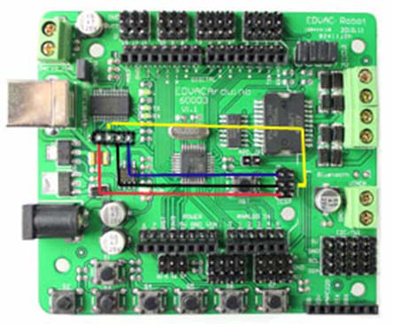
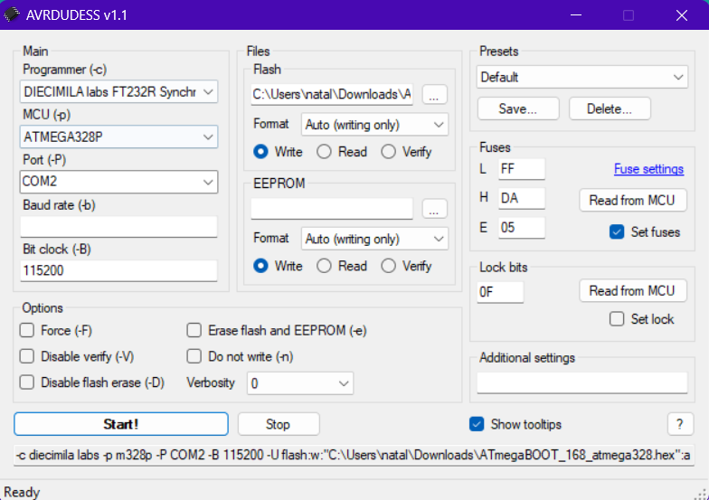

# Arduino Diecimila Bootloader Recovery

This tutorial describes the process of recovering the bootloader of an Arduino Diecimila board used on the NEXUS 4WD Mecanum robot.

The process of burning the bootloader might be necessary if the bootloader is corrupted or erased, and the board is not responding to the programmer. Then flashing the firmware to the bricked board is not possible, and burning the bootloader is required to retrieve the board's functionality.

## Background

Burning the bootloader was successfully performed on Windows 11, other operating systems might require different steps. The bricked board was lastly recovered in November 2023, back then the following log messages were displayed during flashing:
```
avrdude: stk500_recv(): programmer is not responding
avrdude: stk500_getsync() attempt 1 of 10: not in sync: resp=0x00

```

## Sanity Check before Burning Bootloader

Before starting burning the bootloader, verify that the board is not responding to the programmer due to a different issue. Make sure that there is no issues with:
- connections between the board and the programmer,
- power supply to the board,
- other hardware-related issues,
- ensure that your Diecimila board is not responding to the programmer, and you see similar log messages as mentioned previously.

## Instructions

1. **Install AVRDUDESS GUI (v1.1)**
- Download the AVRDUDESS v1.1 (old legacy version) from [here](https://github.com/ZakKemble/AVRDUDESS/releases/tag/v1.1).
- Extract the contents of AVRDUDESS-1.1.zip.

2. **Modify AVRDUDE Config File**
- Replace the AVRDUDE config file `avrdude.conf` in the extracted subdirectory (`/AVRDUDESS-1.1/src/avrdudess/avrdude.conf`) with the modified [avrdude.conf](avrdude.conf) file, which includes added, dedicated Diecimila programmer configuration.

3. **Connect Hardware**
- Remove the shield from the Diecimila board.
- Connect pins from X3 header with ICSP (In-circuit serial programming) pins based on the provided image:  


4. **Configure AVRDUDESS**
- Open the AVRDUDESS application.
- Set the configuration as shown in the image:  

- Set the bootloader binary file in Files/Flash tab to [ATmegaBOOT_168_atmega328.hex](ATmegaBOOT_168_atmega328.hex).
  - The file can be also downloaded from [here](https://github.com/arduino/ArduinoCore-avr/blob/master/bootloaders/atmega/ATmegaBOOT_168_atmega328.hex).

5. **Burn Bootloader**
- Click the "Start!" button to begin burning the bootloader.

6. **Verify Successful Burning**
- Disconnect the USB cable from Diecimila.
- Remove the wire connections between X3 and ICSP.
- Reconnect the USB cable to Diecimila.
- Press the reset button on Diecimila.
- Start the Arduino IDE.
- Program a sample sketch, such as "Blink."
- Verify that the sketch runs successfully.

Arduino Diecimila board should now be recovered with a new bootloader. If you encounter any issues during the process, double-check the connections and follow the steps precisely.

